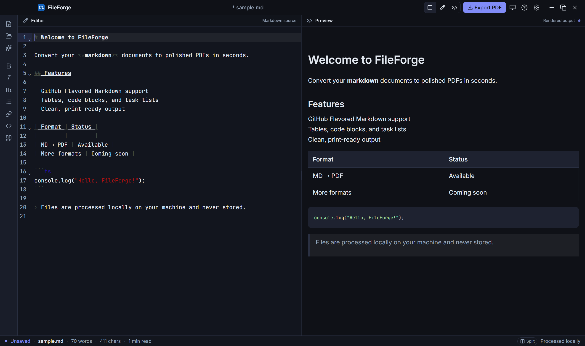

# FileForge Desktop

A production-ready Tauri 2 desktop app for converting Markdown to PDF locally.



## Features

- **CodeMirror 6** markdown editor with syntax highlighting
- **Live GFM preview** with Prism code-block highlighting
- **Split / Focus / Preview** layout modes
- **4 color schemes** (Default, GitHub, Nord, Dracula) with light/dark/system themes
- **Local PDF export** via system Chrome or Edge (no cloud, no network)
- **Native file dialogs**, app menu shortcuts, system tray, window state persistence
- **Auto-updater** via GitHub Releases (requires signed builds in production)

## Prerequisites

- [Node.js](https://nodejs.org/) 20+
- [pnpm](https://pnpm.io/) 9+
- [Rust](https://www.rust-lang.org/tools/install) (`rustup`)
- **Windows:** [Visual Studio Build Tools](https://visualstudio.microsoft.com/visual-cpp-build-tools/) with the "Desktop development with C++" workload (provides `link.exe`)
- [Tauri prerequisites](https://v2.tauri.app/start/prerequisites/) for your OS
- **Google Chrome** or **Microsoft Edge** (required for PDF export)

## Development

```bash
pnpm install
pnpm tauri dev
```

## Build

```bash
pnpm tauri build
```

Produces installers for your current platform (`.msi`/`.exe` on Windows, `.dmg`/`.app` on macOS).

## Releasing

1. Bump the version in `package.json`, `src-tauri/Cargo.toml`, and `src-tauri/tauri.conf.json` to the same value (e.g. `0.1.1`).
2. Add a changelog entry in `src/data/changelog.ts`.
3. Commit and push to `main`.
4. Tag and push: `git tag v0.1.1 && git push origin v0.1.1`
5. GitHub Actions builds installers and `latest.json`, then creates a draft release.
6. Review assets on GitHub and publish the draft release.

The git tag (`vX.Y.Z`) must match `tauri.conf.json` version (`X.Y.Z`). CI fails if they differ.

## Keyboard shortcuts

| Shortcut | Action |
|----------|--------|
| `Ctrl+N` | New document |
| `Ctrl+O` | Open file |
| `Ctrl+Shift+E` | Export to PDF |
| `Ctrl+1` | Split view |
| `Ctrl+2` | Focus mode |
| `Ctrl+3` | Preview only |
| `Ctrl+,` | Settings |
| `F1` | Keyboard shortcuts |

On macOS, use `Cmd` instead of `Ctrl`.

## Project structure

- `src/` — React frontend (Texodus-inspired shell, CodeMirror editor, preview)
- `src-tauri/` — Rust backend (PDF generation, tray, menus)
- `src/lib/converters/` — Markdown → HTML pipeline (ported from FileForge web)
- `src/themes/` — CSS variable color schemes

## PDF engine

PDF export uses your locally installed Chrome or Edge in headless mode. Set `PUPPETEER_EXECUTABLE_PATH` to override the browser path.

## License

This project is open source under the [MIT License](LICENSE).

Copyright (c) 2026 Hossam A. Elsayed
